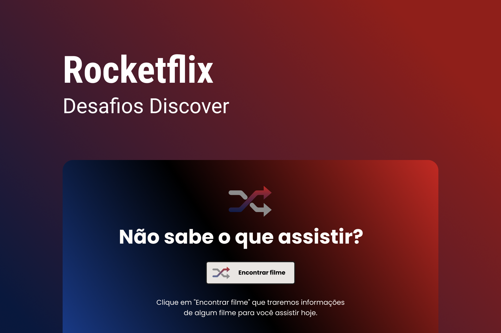

<h1 align="center">
  
</h1>

# ✅ **Requisitos**

---

Neste desafio foi proposto a utilização da API do themoviedb.org para exibir um filme aleatório sempre que clicar em Encontrar Filme.

**Requisitos para o desafio:**

- Consumir a API do [https://www.themoviedb.org/](https://www.themoviedb.org/)

- Ter um botão que traga um filme aleatório com poster e descrição do filme.

- Se o filme não existir, apresente uma mensagem e imagem informando que o filme não está disponível.

**_Se desafie também:_**

- Tornando o site responsivo

- Exibindo mais informações sobre os filmes que vem da API (Data de lançamento, atores...)

# 🎨 Style Guide

---

## **Cores:**

```css
:root {
  --title: #fffcf9;
  --text: #000000;
  --bg-button: #e9e6e3;
  --background: linear-gradient(43deg, #102d71 0%, #000000 52%, #c12a23 100%);
}
```

## **Tipo de fonte:**

font-family: Poppins

font-weight: 400 e 700

Você pode encontrar a fonte no [Google Fonts](https://fonts.google.com/)

## **Template:**

O template do projeto está [aqui](https://www.figma.com/file/9HFoO4wNB150gRSV4v0Qse/DD-%2F-Rocketflix/duplicate).

Lembrando que para ver o layout você precisa ter uma conta no [figma](https://www.figma.com)

## **Observação:**

Para utilizar esta aplicação foi utilizada uma chave de API do The Movie DB e por isso é necessário que você faça algumas configurações:

### Configurações no TMDB:

- Crie uma conta no [https://www.themoviedb.org/signup](https://www.themoviedb.org/signup).

- Após verificar o e-mail, faça o login e acesse a parte de [configurações de API](https://www.themoviedb.org/settings/api/request).

- Crie e aceite os termos de uso da API.

- Preencha os dados necessários e clique em Enviar.

- Após clicar em enviar você terá acesso a sua API Key.

### Configurações no Projeto:

- Verifique o arquivo `api-example.js` do projeto.

- Substitua a palavra API_KEY por sua chave.

- Renomeie o arquivo `api-example.js` para `api.js`.
